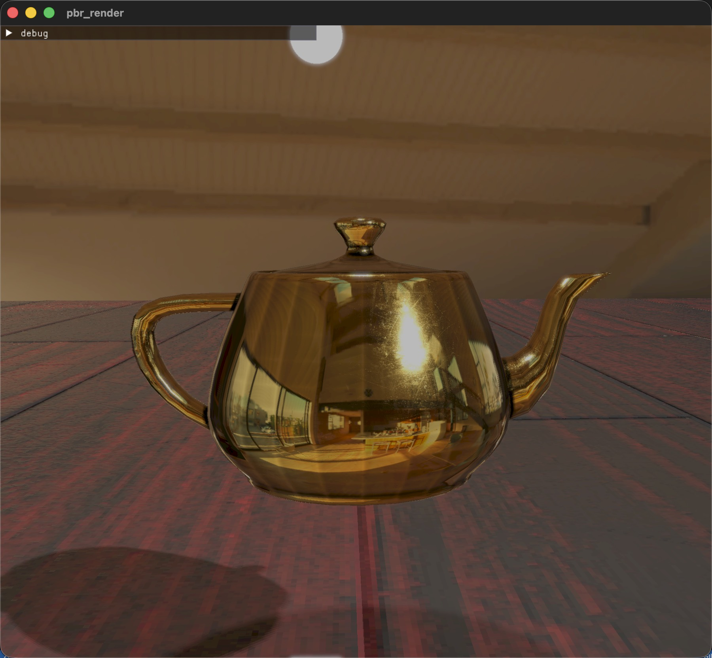
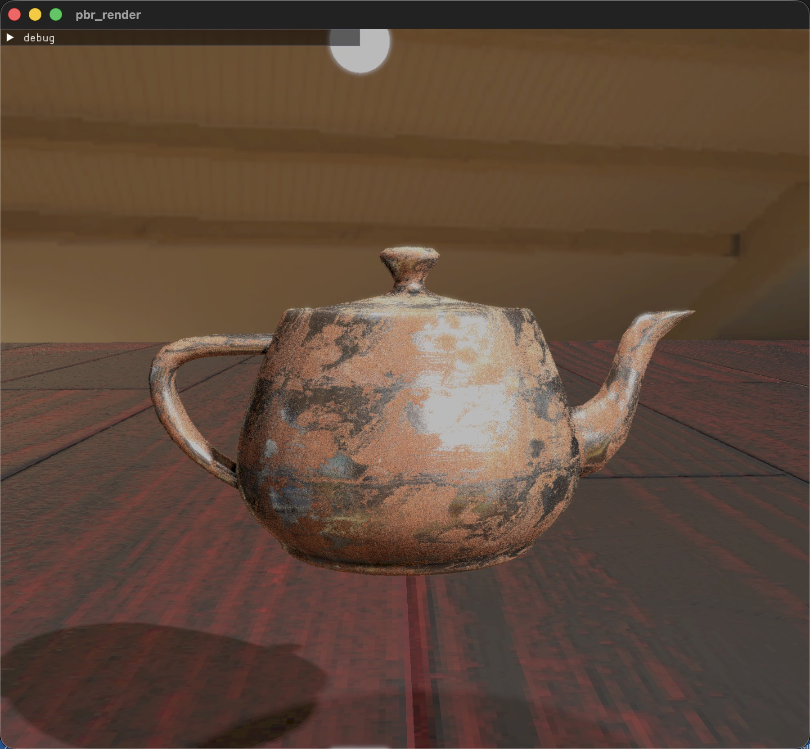
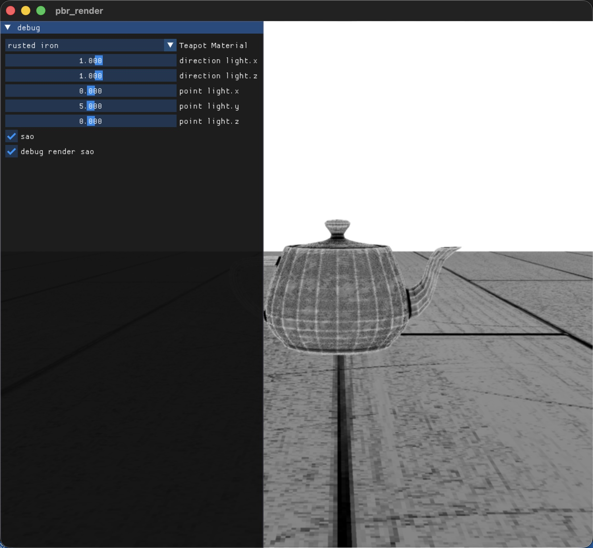

# PBR_Render

### 0. why

这是一个基于C++与OpenGL实现的光栅化的PBR渲染器，基本涵盖了经典教程[LearnOpenGL](https://learnopengl-cn.github.io)中的绝大多数内容，并且参考了部分工业界实践过程中的一些经典处理方法。如果你学习完基本的一些图形学知识与教学内容，可以参考这个作为一次综合的实践。

> 黄金材质渲染结果

> 生锈金属材质渲染结果

> SSAO渲染结果debug

### 1. what

这个项目主要基于***OpenGL 4.0***进行，使用光栅化实现了***迪士尼-金属粗糙度工作流***的PBR渲染，流程上主要采用了***延迟渲染管线***实现，支持漫反射辐照度 与镜面预卷积的***IBL***，集成了一些***常见后处理效果***。

渲染器主要有以下特性

- Camera
  - Move
  - Zoom
  - TODO:Exposure
    - Aperture
    - Shutter speed
    - ISO
- Texture
  - Cube
  - HDR
  - 2D
- Model
  - .obj
- Material
  - Cook-Torrance BRDF
    - Albedo
    - Normal
    - Roughness
    - Metalness
    - AO
  - Lambert
  - Phong(未应用)
    - ambient
    - diffuse
    - specular
- 渲染流程
  - Deffered
  - Instance
  - TODO:forward for transparent
- IBL
  - SAO(AlchemyAO)
  - Diffuse irradiance
  - Specular IBL
- Lighting
  - Directional
  - Point
  - TODO:Spot
  - TODO:Volume Light
  -  *Cook-Torrance* BRDF
- SkyBox
  - Cube
- Shadow
  - 包围球模拟的方向光源
  - 点光源立方体阴影贴图
  - 软阴影
    - PCF
    - TODO:PCSS
- Post Process
  - Anti-aliasing
    - FXAA
    - TODO:TAA
  - Bloom
  - Motion blur
- 其他
  - spdlog
  - IMGUI

### 2. how

渲染流程可以参考如下：

[点击查看我的学习博客](https://plallallla.github.io/summer_bug_wants_ice/#/cg_index)

### 3. reference

[练手仓库链接](https://github.com/plallallla/CG_Demo)

学习参考自以下内容：

[LearnOpenGL](https://learnopengl-cn.github.io)

[pbr-book](https://www.pbr-book.org/3ed-2018/contents)

[Games101](https://www.bilibili.com/video/BV1X7411F744/?spm_id_from=333.788.videopod.episodes&vd_source=35656623bbb678de699bcd2742ccb713)

[Games202](https://www.bilibili.com/video/BV1YK4y1T7yY/?spm_id_from=333.1387.collection.video_card.click&vd_source=35656623bbb678de699bcd2742ccb713)

[***浅墨***的《Real-Time Rendering 3rd》 提炼总结](https://github.com/QianMo/Game-Programmer-Study-Notes/blob/master/Content/《Real-Time%20Rendering%203rd》读书笔记/README.md)

[JoshuaSenouf的gl-engine项目](https://github.com/JoshuaSenouf/gl-engine)